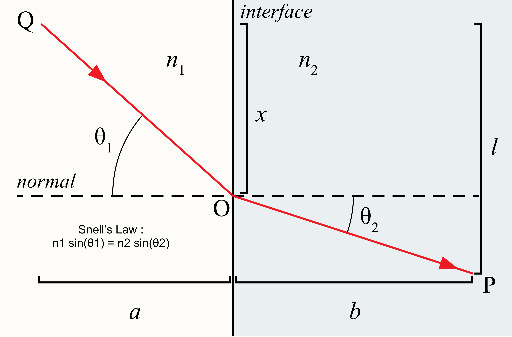
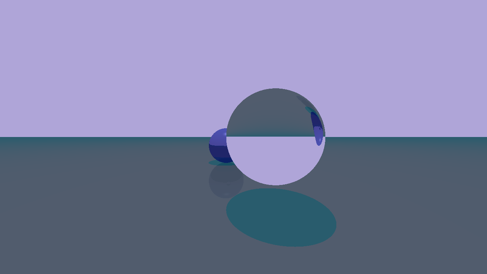
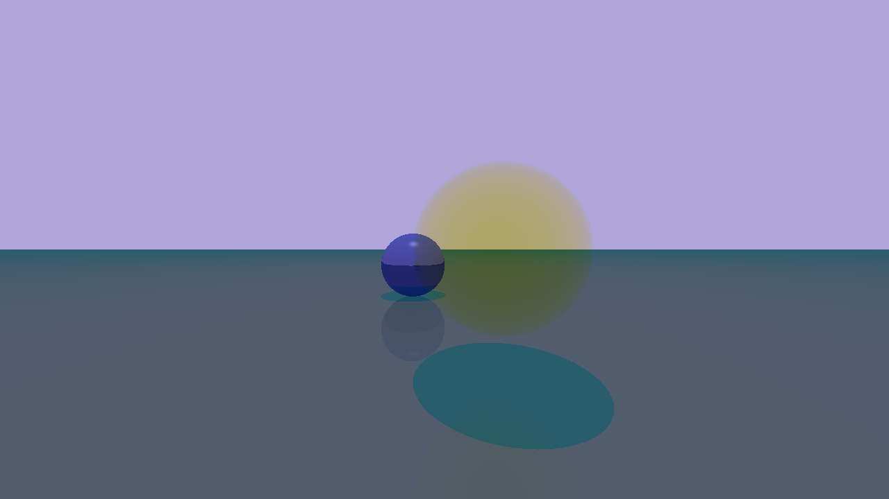
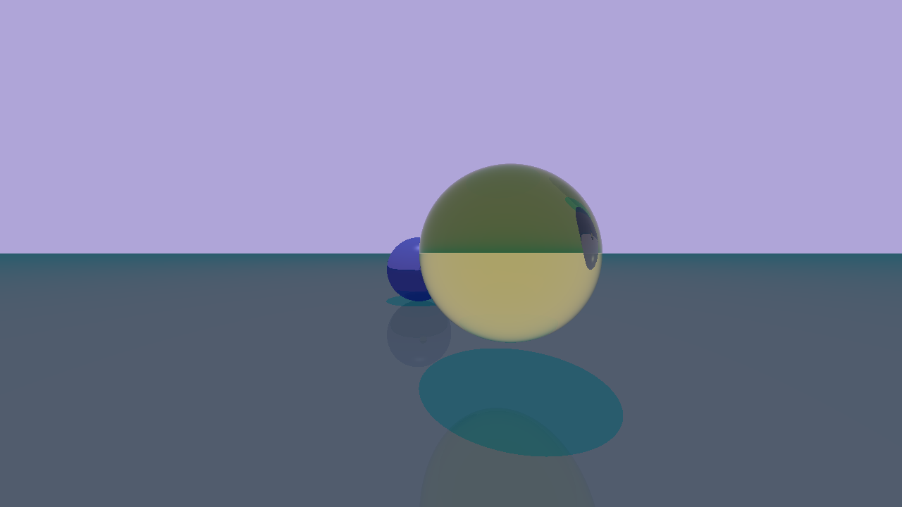
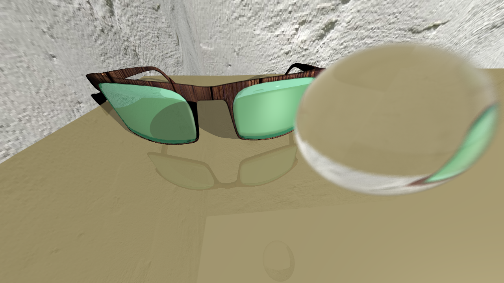
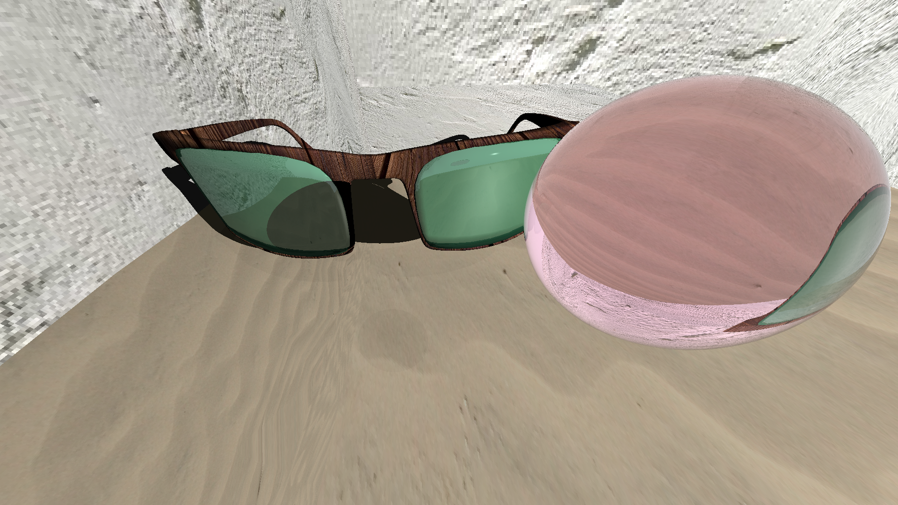

# Abstract

In this project we updated the raytracer from the course by adding multiple features: refraction, absorbtion, depth of field and texture. Moreover we are also using obj files instead of OFF files because obj files have texture coordinates and we implemented a KD-Tree algorithm to accelerate the renderings.

# Technical approach

## Refraction

The first thing that we implemented was the refraction. To implement it we used Snell's law [1]. The first part was to include the refraction coefficient in Material.h. After this, we had to implement it in the Scene::trace.

{width="2560px"}

When we tried to apply Snell's law we are trying to figure out θ2, ib order to trace the refractive ray, because we already have sin θ1, n1 and n2. When the ray enter the material n1 is 1 (the air refraction coefficient) and n2 is material.refraction but when the ray is already in the material and go back to the air n1 is the material.refraction and n2 is 1. So we encoutered this problem and to solve it we used the normal. Indeed, by computing the dot product between the direction of the ray and the normal know if the ray is entering or not the object. By knowing it we were able to compute the refraction coefficient. For the refraction we get most of our information from there (Tizian also advises us to look at this website after the first milestone) [2].

{width="1280px"}

## Absorbtion

Implementing the absorbtion was harder than the refraction. First, same as the refraction, we had to add an absorbtion coefficient (a vec3 because the refraction has r, g and b components). The next step was to implement Beer-Lamberts's law [3]: $T = 10^{-A}$, where $A$ is the absorbtion coefficient multiplied by the distance travelled in the material, and $T$ is the Transmittence which is 1 when there is no absorbtion. Then we multiply the color we obtained by $T$. Moreover there is absorbtion only if the refraction coefficient is not 0 (if there is only absorbtion we set the refraction coefficient to 1).

But to do so we had to compute the distance covered by the ray in any objects, and it took us many times to find a solution. What we are doing is that we introduce a boolean that computes if the ray that intersect the object comes from the outside of the object or not (same dot product than earlier). If yes, we compute the next intersection, then take the distance between the two intersections [4] and finally computes the transmittence using this distance. However, if the boolean is false it means that the next ray will go through the air (we set the air absorbance to 0) the transmittence will be 1.

{width="1280px"}

On this image, that is a sphere with no refraction or reflection and that only absorb blue, we can see that the blue is indeed absorb. The cyan (blue and green) becomes only green and the purple background (blue and red with a small part of green) becomes yellow (red and green). Moreover, we can observe that on the side of the sphere the absorbtion is lighter. Indeed because the ray is covering a smaller distance, the absorbtion is not as strong as in the center.

Then we combine both refraction and absorbtion

{width="1280px"}

## Fresnel Coefficient

However as you can see on the image, there is one missing part which is the reflection on the object. To add it we use the Schlick's approximation [5] to compute the Fresnel coefficient. So we add to vec3.h a method that compute the Fresnel coefficient, and then instead of returning only the refracted and absorb color we return a linear interpolation between the reflected color and the refracted color depending on the Fresnel coefficient [4].

{width="1280px"}

## Depth of Field

The next step was too implement depth of field [6]. To do it we add a focal distance in the camera parameter. Then for each ray that we launch from the camera we compute its focal point. Then we throw multiple ray from the primary ray origin with a small random offset and average the resulting color [7]. 

To choose the number of ray that we send we set the variable number_of_ray in scene.cpp. If there is less ray there will be more small points on some blur part, if there is more ray the scene will take more time to be compute.

The focal distance can be change very easily in the .sce files (it is the last attribute of camera).

{width="1280px"}

{width="1280px"}

{width="1280px"}

{width="1280px"}

## Implementation of the texture 

We implemented a texture functionality to the raytracer. To do so we decided to implement a UV mapping of texture.

We flatten triangle over an image using Blender, and it gives us two textures coordinates for each point of each triangle. Each time our ray intersects a triangle, we interpolate the UV coordinates of the intersection point using the barycentric coordinates.

The first part was to implement an obj reader to get the UV coordinates of each point. We used the TinyObj library [8] to read our obj files. In the Mesh.cpp file we check if the mesh has a texture if so we load the image of texture in a new Texture class. This class uses the stb library [10] to load the image. This library read raw pixel data as a stream of unsigned char. we had to demultiplex this stream to get independent value for red, green and blue channels. Therefore we created a struct of RGB composed of 3 u_int8 variables. This struct has a color function, that returns a vec3 of normalized RGB colored given the index of the pixel to read in the stream.
We added this texture optional parameter to our Material class.  As we are not very used to C++ this part was really challenging and took us a tremendous amount of time to complete. We had a lot of pointers issues. We didn't understand the way unique_pointer really worked and the memory flow. We had to understand the way stb read the image to get the right pixel value, get the right different channels, and normalize the pixel;

Using what returned TinyObj loader we now store each point position and each UV  texture coordinates.
We store each point index for each point of each triangle in the mesh, compute normals.

At this point, we had everything to get the textures of an obj file.

We had to modify the Scene.cpp and every object intersects method to handle the texture value. For each intersection point with a triangle, we interpolate the UV coordinates using the barycentric coordinates. We get the color of the texture and we pass it to a pointer through the whole raytracing process until the lighting function where we had to modify the diffuse color. This part was not really challenging.

Debugging part and getting the first convincing results took us no more than 4 days entirely dedicated to it.

## Information during the raytracing

When we launch the raytracer we now have an update of the percentage of column done in the terminal. We implement it in the scene::render function.

## Creation of the scene 

We wanted to show the most beautiful possible scene in a Full HD rendered (1080p with a width of 1920 pixels). We add plaster walls and a sand texture on the floor. We add a sphere that absorbs green and blue so it is red transparent! For the glasses we chose to create sports' sunglasses with reflected blue-green glasses and a wood texture for the frame.

{width="1920px"}

## KD-Trees

Instead of having a KD-Tree for one scene we decided to have one for every Mesh in the Scene.
For that we first implemented a new class called KDNode (which is located in the Mesh.h file since it is only used in Mesh). Such a class consists of:  

- two pointers; to it's left and right child node respectively  
- a boolean variable indicating whether it is a leaf node  
- a vector of indices (which is used to indicate the triangles belonging to the node) only filled for leaf nodes
- a bounding box for the node

For convenience we moved the Triangle structure from the Mesh file into the Triangle.h file such that it can also be used in the KDNode class.
Furthemore, we added two attributes: midpoint and bounds, respectively specifying the midpoint and the bounding box for each triangle. Those properties are initialized in the Mesh::compute_normals function.
We have also created a Box class, not only holding a min and max vector but also it's longest axis. It comes with three functions which allow us to merge two boxes into a new one, expand the current box and check the intersection with a ray (old intersect\_bounding\_box function from Mesh).

At the end of the Mesh::read function we create the root KDNode for the Mesh calling the static KDNode::build function which recursively splits along the longest axis until it reaches an node which holds only one triangle (leaf) or the maximal depth (which is set to 10 for now).  
Then, every leaf node of the tree stores the indices to the triangles located in the (now public) triangles_ array of the corresponding Mesh.

The Mesh::intersect function now checks the intersection with it's root node (holding the same bounding box as the Mesh's one) and if the result is positive then the root node traverses the tree and returns pointers to all the leafs vector of indices such that the Mesh will only check triangle intersection with the triangles in the returned indices instead of the whole array.

Trying to render some images with and without KD-Tree algo:

| Scene | classic raytrace | KD-Tree raytrace |   
| --- | --- | --- |   
| mask.sce | 101.804 s | 2.117 s |
| toon_faces.sce | 298.314 s| 6.186 s |

# Result

{width="1920px"}

For the final scene we add a focus on the sphere.

So we implemented everything that was in the core of the project and two extensions : depth of field and KD-Trees. Moreover we add small information about the advancement of the raytracing !

To launch the image use this command when you are in the build folder : ./raytrace ../scenes/final_scene/final.sce nameOfImage.png

# Contribution of each group member

Most of the time we were all together and do the task together,however to add something relevant for the team member contribution part, even when we were together we assign a leader to each part. Jeniffer leads the refraction and KD-trees, Ruben leads the absorbtion, the Fresnel coefficient computation and the depth of field and Jean leads the scene and texture part.

# References

[1] Snell's law : https://en.wikipedia.org/wiki/Snell%27s_law

[2] Website we used to learn more about refraction : https://www.scratchapixel.com/lessons/3d-basic-rendering/introduction-to-shading/reflection-refraction-fresnel

[3] Beer-Lambert's law: https://en.wikipedia.org/wiki/Beer–Lambert_law

[4] Website we used to learn more about absorbtion and Fresnel coefficient (with Schlick's approximation) : https://blog.demofox.org/2017/01/09/raytracing-reflection-refraction-fresnel-total-internal-reflection-and-beers-law/

[5] Schlick's approximation : https://en.wikipedia.org/wiki/Schlick's_approximation

[6] Depth of field : https://en.wikipedia.org/wiki/Depth_of_field

[7] Website we used to implement depth of field : https://medium.com/@elope139/depth-of-field-in-path-tracing-e61180417027

[8] Library used to load obj files : https://github.com/syoyo/tinyobjloader

[9] Website inspiration for implementing KD-Tree : https://blog.frogslayer.com/kd-trees-for-faster-ray-tracing-with-triangles/

[10] Library used to load images : https://github.com/nothings/stb